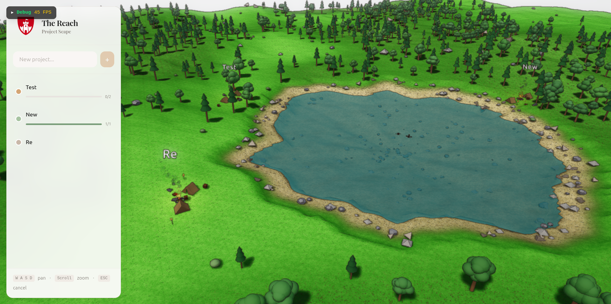

# The Reach

[](https://claude.ai)

[](https://vitejs.dev/)
[](https://react.dev/)
[](https://www.babylonjs.com/)
[](https://tailwindcss.com/)
[](https://tauri.app/)
[](https://fastapi.tiangolo.com/)
[](https://www.postgresql.org/)
[](https://zustand-demo.pmnd.rs/)

<p align="center">
  
</p>

A project management and AI orchestration platform that represents projects as interactive 3D worlds. Tasks, timelines, and autonomous agents can be observed and controlled from a single strategic view.

## Overview

The Reach reimagines project management as an explorable 3D landscape. Each project becomes an island in a procedurally generated world, complete with terrain, vegetation, and a flowing river. The strategic top-down camera lets you survey your entire project ecosystem at a glance.

## Project Structure

```
The_Reach/
├── frontend/               # React + Babylon.js app
│   ├── src/
│   │   ├── babylon/        # 3D engine (scene.ts, terrain.ts, engine.ts)
│   │   ├── components/     # React UI components
│   │   ├── stores/         # Zustand state management
│   │   └── api/            # FastAPI client
├── backend/                # FastAPI server
├── src-tauri/              # Tauri desktop wrapper
└── docker-compose.yml      # PostgreSQL container
```

## Getting Started

### Prerequisites

- Node.js 18+
- Python 3.11+
- Docker & Docker Compose
- Rust (for Tauri desktop builds)

### Quick Start

```bash
# Start PostgreSQL
docker compose up -d

# Start backend
cd backend
source .venv/bin/activate
uvicorn main:app --reload

# Start frontend (new terminal)
cd frontend
npm install
npm run dev

# Or run as desktop app
npm run tauri dev
```

## Features

- **3D Project Visualization** - Projects rendered as interactive islands
- **Procedural Terrain** - Multi-octave Perlin noise with river carving
- **Strategic Camera** - WASD panning, scroll zoom, top-down view
- **Task Management** - Create, track, and complete tasks per project
- **Real-time Updates** - Changes reflected instantly in the 3D world

## Controls

| Input | Action |
|-------|--------|
| WASD | Pan camera |
| Scroll | Zoom in/out |
| Click island | Select project |
| Click terrain | Place/move project (in placement mode) |
| Escape | Cancel placement |

## Documentation

- [DESIGN.md](./DESIGN.md) - Visual design principles, shaders, and aesthetic
- [AI_INSTRUCTIONS.md](./AI_INSTRUCTIONS.md) - Development guidelines for AI assistants

## License

MIT
