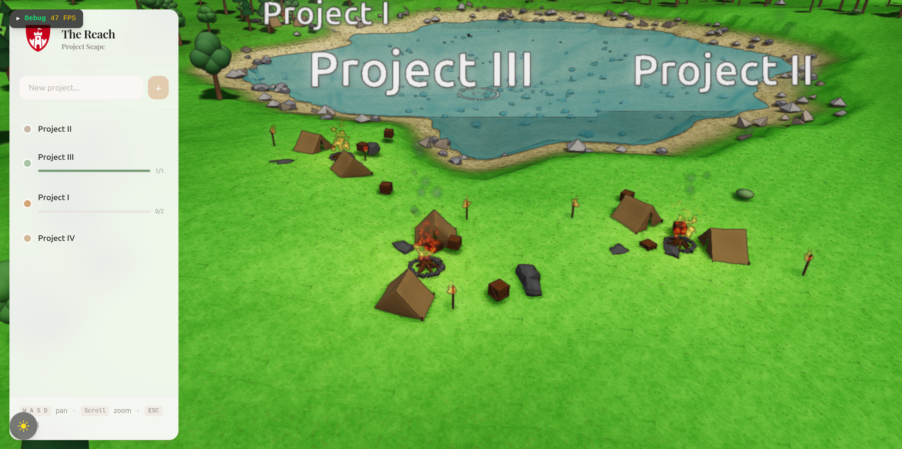

# The Reach

[](https://claude.ai)

[](https://vitejs.dev/)
[](https://react.dev/)
[](https://www.babylonjs.com/)
[](https://tailwindcss.com/)
[](https://tauri.app/)
[](https://fastapi.tiangolo.com/)
[](https://www.postgresql.org/)
[](https://zustand-demo.pmnd.rs/)

<p align="center">
  
</p>

Your projects as living worlds. Each project becomes a procedurally generated settlement that evolves from a humble campsite to a thriving castle as you make progress.

## Overview

The Reach transforms project management into an explorable 3D landscape with a low-poly aesthetic and realistic lighting. Projects are visualized as settlements on procedural terrain - complete with lakes, forests, wildlife, and dynamic day/night cycles.

**Settlements evolve through 5 tiers based on project activity:**

| Tier | Settlement | Triggers |
|------|------------|----------|
| 1 | Campsite | New project, tents & campfire |
| 2 | Outpost | Early progress, wooden huts |
| 3 | Village | Steady work, full palisade |
| 4 | Town | Thriving, stone walls & market |
| 5 | Castle | Excellence, towers & banners |

## Features

- **Procedural Terrain** - FBM noise-based landscapes with lakes, rocks, and vegetation
- **Living Ecosystem** - Sheep grazing, birds flying, fish swimming, ducks in water
- **Dynamic Lighting** - Day/night cycle with stars, campfire glow, and smoke particles
- **Settlement Evolution** - Camps upgrade as you complete tasks and stay active
- **Ambient Details** - Water ripples, grass particles, fire effects

## Project Structure

```
The_Reach/
├── frontend/               # React + Babylon.js app
│   ├── src/
│   │   ├── babylon/        # 3D engine (scene.ts, terrain.ts, engine.ts)
│   │   ├── components/     # React UI components
│   │   ├── stores/         # Zustand state management
│   │   └── api/            # FastAPI client
├── backend/                # FastAPI server
├── src-tauri/              # Tauri desktop wrapper
└── docker-compose.yml      # PostgreSQL container
```

## Getting Started

### Prerequisites

- Node.js 18+
- Python 3.11+
- Docker & Docker Compose
- Rust (for Tauri desktop builds)

### Quick Start

```bash
# Start PostgreSQL
docker compose up -d

# Start backend
cd backend
source .venv/bin/activate
uvicorn main:app --reload

# Start frontend (new terminal)
cd frontend
npm install
npm run dev

# Or run as desktop app
npm run tauri dev
```

## Controls

| Input | Action |
|-------|--------|
| WASD | Pan camera |
| Scroll | Zoom in/out |
| Click island | Select project |
| Click terrain | Place/move project (in placement mode) |
| Escape | Cancel placement |

## Why Not?

Project management doesn't need to be a spreadsheet. So we added:

- **Sheep** that graze and scatter grass particles
- **Birds** circling overhead
- **Fish** swimming in the lake, **ducks** splashing around
- **Campfires** with flickering flames and smoke plumes
- **Stars** that fade in at night
- **Water ripples** and reflections
- **PBR materials** with SSAO, bloom, and ACES tone mapping
- **Day/night cycle** with warm sunsets and glowing windows

None of it is essential. All of it makes you want to keep your projects alive.

## Future

**Agent Visualization** - Watch your Claude Code sessions and other AI coding agents work in real-time. Each agent gets their own character in your settlement:

| Agent      | Character          | Activity          |
|------------|--------------------|-------------------|
| Builder    | Hammer & hardhat   | Creating features |
| Fixer      | Wrench & toolbelt  | Squashing bugs    |
| Researcher | Glasses & scroll   | Exploring code    |

See agents spawn at your project, walk between buildings, and despawn with celebration particles when tasks complete. Multi-project agents leave visible trails as they travel between settlements.

**GitHub Integration** - Connect repos to automatically track commits, PRs, and issues. Activity flows into your settlement's health score.

**Multiplayer Worlds** - Share a realm with your team. Watch everyone's projects grow together.

## Documentation

- [DESIGN.md](./DESIGN.md) - Visual design principles, shaders, and aesthetic
- [AI_INSTRUCTIONS.md](./AI_INSTRUCTIONS.md) - Development guidelines for AI assistants

## License

MIT
